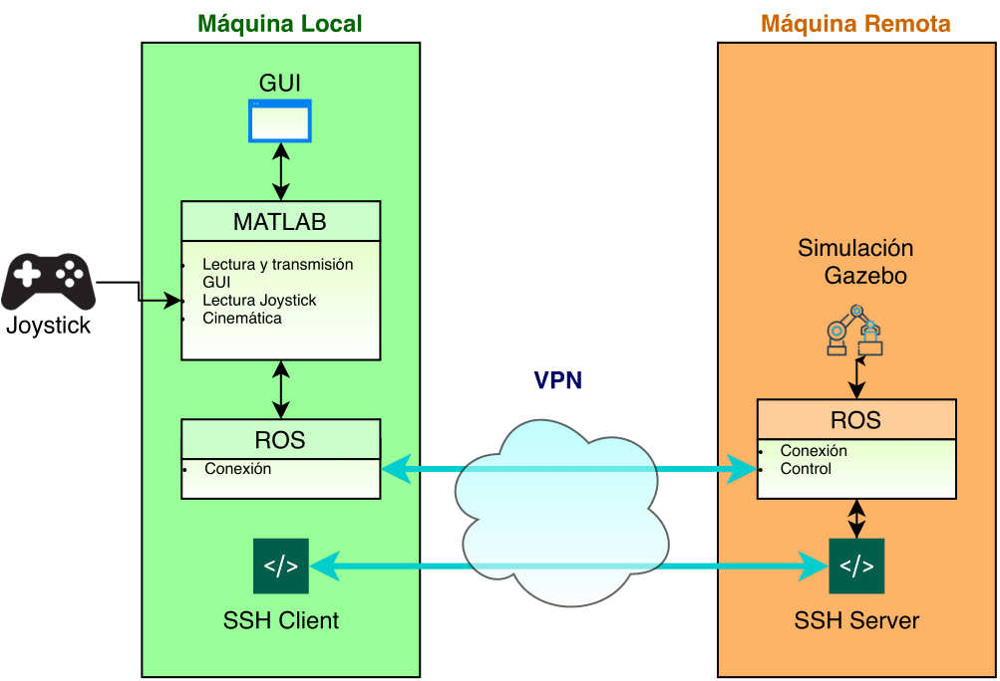

# Robotica-Proyecto
Proyecto intermedio de la asignatura de Robótica, en la que se resuelve la conexión de diferentes elementos relacionados con el control y visualización de manipuladores seriales utilizando ROS como plataforma de integración.

## Videos:
- [Video Demostrativo](https://www.youtube.com/watch?v=el7a4DUKw08&feature=youtu.be)
- [Video de Presentación](https://www.youtube.com/watch?v=ZiEr0SK4JKs&feature=youtu.be)
## Enlace de Informe
[Overleaf](https://es.overleaf.com/project/5ef7c376717bba0001d75b5c)
## Requisitos
- Al menos dos máquinas con ROS.
- Conexión local o vía VPN en ambas máquinas.
- Joystick
## Instrucciones
Se presentan instrucciones para sistemas basados en GNU/Linux.
### - Configuración de la Red
Se debe establecer una conexión de red con la arquitectura deseada. Es recomendable que en la máquina que correrá el núcleo de ROS (server) esté configurado un servidor SSH y es fundamental que la IP de esa máquina sea visible desde todas las demás máquinas que se usarán (client).

Se recomienda altamente que los archivos /etc/hosts/ se encuentren configurados igual en todos los equipos conectados, en GNU/Linux se puede arbir este archivo con gedit enviando el comando `sudo gedit /etc/hosts` o con cualquier editor de texto plano como super usuario. La configuración de este archivo consiste en agregar los número IP y nombres de Host fáciles de recordad de todos los equipos conectados a la red con el siguiente formato:
```
[IP1]   [HOST_NAME1]    [IP1]
[IP2]   [HOST_NAME2]    [IP2]
  .          .            .
  .          .            .
  .          .            .
  ``` 
          


Se puede probar la conectividad de la red verificando ping desde cada client al server y viceversa, así como la conexión SSH.
La arquitectura de red en la que se implementó este Git es mostrada en la siguiente figura:


### - Conectividad de ROS
Para que todas las máquinas trabajen sobre el mism núcleo, se debe configurar en cada terminal las variables de entorno `ROS\_MASTERURI` , `ROS\_HOSTNAME` y `ROS\_IP`con los siguientes comandos en cada terminal:
```
  export ROS_MASTER_URI=http://[ROSCORE_HOSTNAME]:11311/
  export ROS_HOSTNAME=[LOCAL_HOSTNAME]
  export ROS_IP=[LOCAL_IP]
```
Esto se puede automatizar agregando las siguientes líneas al archivo `~/bashrc`
```
  export ROS_MASTER_URI=http://[ROSCORE_HOSTNAME]:11311/
  export ROS_HOSTNAME=[LOCAL_HOSTNAME]
  export ROS_IP=[LOCAL_IP]
  
  echo MASTER $ROS_MASTER_URI
  echo HOST $ROS_HOSTNAME
  echo IP $ROS_IP
 ```
Con esto se puede probar la conexión de ROS iniciando el núcleo y listando los nodos y tópicos, así como suscribiendose a los tópicos desde los clientes.
### - Simulación Gazebo.
Clonar e integrar este repositorio en la carpeta src de un espacio de trabajo en catkin en las máquinas en que se correrá la simulación, esto se puede hacer con los siguientes comandos ejecutados desde la raíz del espacio de trabajo:
```
cd src
git clone https://github.com/JulianDMN/Robotica-Proyecto/
cd ..
source devel/setup.bash
catkin_make
```
Para lanzar la simulación en Gazebo, se debe ejecutar el comando `rosrun gazebo_ros gazebo`.
Para enviar el robot a la simulación, se debe ejecutar el comando `roslaunch phantom_urdf spawn.launch`.
Estos comandos pueden ser ejecutados desde distintas máquinas siempre que estén debidamente conectadas.
### - Control con Matlab.
Es necesario tener los siguientes toolbox instalados en MATLAB:
- Peter Corke V9.10
- Simulink 3D Animation
- Optimization Toolbox
- ROS Toolbox

El script para controlar la simulación es /MScripts/Lab_3.m. Antes de correr el Script, es importante configurar las variables de ROS, lo cuál se puede hacer con estos comandos en la consola de MATLAB:
```
setenv('ROS_MASTER_URI','http://[ROSCORE_HOSTNAME]:11311/')
setenv('ROS_HOSTNAME','LOCAL_HOSTNAME')
setenv('ROS_IP','[LOCAL_IP]')
```

El script se debe correr mientras la simulación en Gazebo está corriendo, al correrse debería abrirse la GUI que permite controlar la simulación.
## Autores:
- Johan Camilo Herrera Pinilla    <jocherrerapi@unal.edu.co>
- Johan Sebastian Huertas Castro  <joshuertasca@unal.edu.co>
- Pablo Andrés Meneses Rincón     <pamenesesri@unal.edu.co>
- Julián David Montenegro Niño    <jdmontenegron@unal.edu.co>

Universidad Nacional de Colombia

Sede Bogotá

Facultad de Ingeniería
